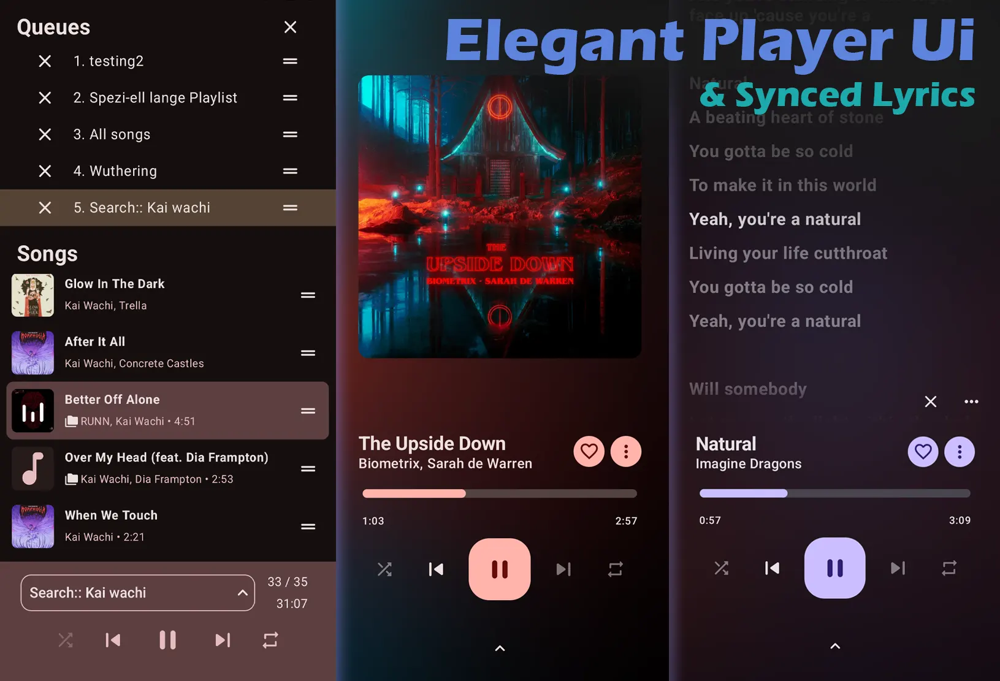

# OuterTune

A Material 3 YouTube Music client & local music player for Android

[](https://apps.obtainium.imranr.dev/redirect?r=obtainium://app/%7B%22id%22%3A%22com.dd3boh.outertune%22%2C%22url%22%3A%22https%3A%2F%2Fgithub.com%2FDD3Boh%2FOuterTune%22%2C%22author%22%3A%22DD3Boh%22%2C%22name%22%3A%22OuterTune%22%2C%22preferredApkIndex%22%3A0%2C%22additionalSettings%22%3A%22%7B%5C%22includePrereleases%5C%22%3Afalse%2C%5C%22fallbackToOlderReleases%5C%22%3Atrue%2C%5C%22filterReleaseTitlesByRegEx%5C%22%3A%5C%22%5C%22%2C%5C%22filterReleaseNotesByRegEx%5C%22%3A%5C%22%5C%22%2C%5C%22verifyLatestTag%5C%22%3Afalse%2C%5C%22dontSortReleasesList%5C%22%3Afalse%2C%5C%22useLatestAssetDateAsReleaseDate%5C%22%3Afalse%2C%5C%22trackOnly%5C%22%3Afalse%2C%5C%22versionExtractionRegEx%5C%22%3A%5C%22%5C%22%2C%5C%22matchGroupToUse%5C%22%3A%5C%22%5C%22%2C%5C%22versionDetection%5C%22%3Atrue%2C%5C%22releaseDateAsVersion%5C%22%3Afalse%2C%5C%22useVersionCodeAsOSVersion%5C%22%3Afalse%2C%5C%22apkFilterRegEx%5C%22%3A%5C%22%5C%22%2C%5C%22invertAPKFilter%5C%22%3Afalse%2C%5C%22autoApkFilterByArch%5C%22%3Atrue%2C%5C%22appName%5C%22%3A%5C%22%5C%22%2C%5C%22shizukuPretendToBeGooglePlay%5C%22%3Afalse%2C%5C%22allowInsecure%5C%22%3Afalse%2C%5C%22exemptFromBackgroundUpdates%5C%22%3Afalse%2C%5C%22skipUpdateNotifications%5C%22%3Afalse%2C%5C%22about%5C%22%3A%5C%22A%20Material%203%20YouTube%20Music%20client%20%26%20local%20music%20player%20for%20Android%5C%22%7D%22%2C%22overrideSource%22%3A%22GitHub%22%7D)

## Features

OuterTune is a supercharged fork of [InnerTune](https://github.com/z-huang/InnerTune), with advanced account synchronization, local media playback, multiple queues, and a new take on UI design.

- Play, search, and save all your songs, videos, albums, and playlists from YouTube Music
    - Song downloading for offline playback
    - Background playback & AD free
- New integrated library screen design & Multiple queues
- Advanced account synchronization
    - YouTube Music account login support
    - Fully fledged syncing of songs, subscriptions, playlists and albums — both to and from your account
- Local audio file playback
    - Play local and Youtube Music songs at the same time
    - We don't use MediaStore's broken metadata extractor! (e.g tags delimited with `\\` now show up properly)
- Synchronized lyrics (LRC format, also includes multi-line support)
- Audio normalization, tempo/pitch adjustment, and various other audio effects
- Android Auto support

## Screenshots

  

  

> **Warning**
>
>If you're in a region where YouTube Music is not supported, you won't be able to use this app
***unless*** you have a proxy or VPN to connect to a YTM supported region.

## FAQ

### Q: How to scrobble music to LastFM, LibreFM, ListenBrainz or GNU FM?

Use other music scrobbler apps. I
recommend [Pano Scrobbler](https://play.google.com/store/apps/details?id=com.arn.scrobble).

### Q: Why OuterTune isn't showing in Android Auto?

1. Go to Android Auto's settings and tap multiple times on the version in the bottom to enable
   developer settings
2. In the three dots menu at the top-right of the screen, click "Developer settings"
3. Enable "Unknown sources"

## Building & Contributing

We are looking for contrubutors, translators, and maintainers! If you would like to help out, or just wish to build the app yourself, please see the [building and contribution notes](./CONTRIBUTING.md).

## Donate

If you like OuterTune, you're welcome to send a donation. Donations will support the development,
including bug fixes and new features.

## Attribution

[z-huang/InnerTune](https://github.com/z-huang/InnerTune) for providing
an awesome base for this fork, none of this would have been possible without it.

[Musicolet](https://play.google.com/store/apps/details?id=in.krosbits.musicolet) for inspiration of a local music player experience done right.
